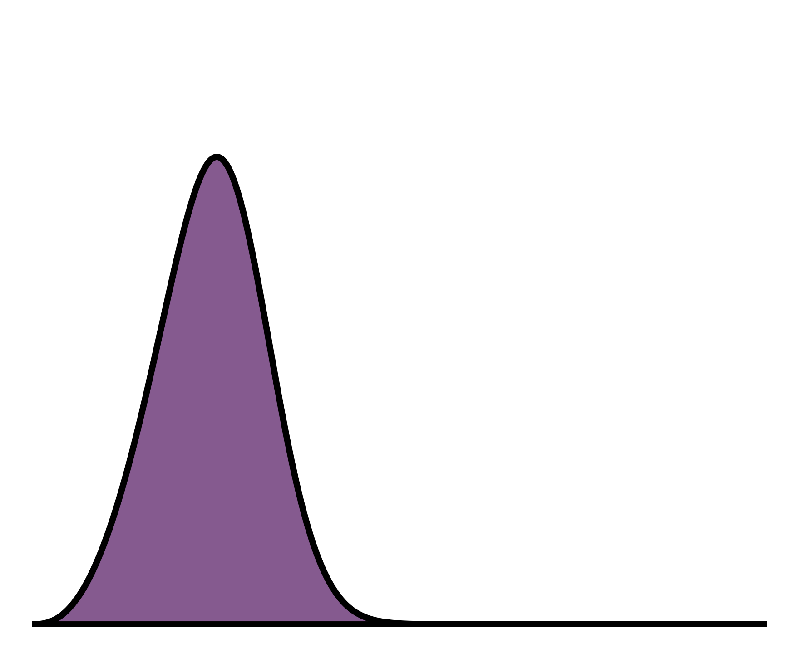

<p align="center">
  
</p>

# binny

[](https://github.com/binny-org/binny/actions/workflows/ci.yml)
[](https://github.com/binny-org/binny/actions/workflows/docs.yml)
[](https://codecov.io/gh/binny-org/binny)
[](LICENSE)

**binny** is a Python library for constructing and analyzing **tomographic redshift bins** used in cosmology and large-scale structure analyses.

It provides flexible binning algorithms, validation utilities, and diagnostic tools designed for forecasting, inference pipelines, and survey analysis workflows.

Detailed documentation, tutorials, and API reference are available at:

👉 **https://binny-org.github.io/binny**

---

# Installation

### Install from source

```bash
git clone https://github.com/binny-org/binny.git
cd binny
python -m pip install -e .
````

### Development install

```bash
python -m pip install -e ".[dev]"
```

---


# Citation

If you use **binny** in your research, please cite it.

```bibtex
@software{sarcevic2026binny,
  title   = {binny: Flexible binning algorithms for cosmology},
  author  = {Šarčević, Nikolina and van der Wild, Matthijs},
  year    = {2026},
  url     = {https://github.com/binny-org/binny}
}
```

Citation metadata is also available in `CITATION.cff`, which GitHub uses to generate citation formats automatically.

---

# Contributing

Contributions are very welcome.
See the **Contributing** guide in the documentation for development workflow,
testing, and code style guidelines.

---

# License

MIT License © 2026 Nikolina Šarčević, Matthijs van der Wild and contributors.

