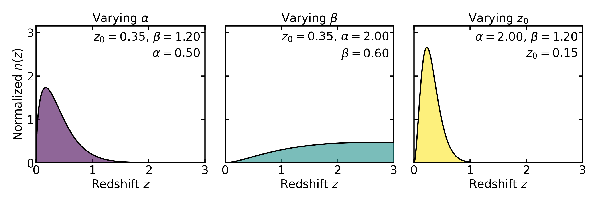

.. |logo| image:: ../../_static/assets/logo.png
   :alt: logo
   :width: 32px

|logo| Analytic parent n(z) models
==================================

Why model a parent :math:`n(z)`?
--------------------------------

In many forecasting or methodology studies, the starting point is not
a fully observed galaxy catalog but an analytic or semi-analytic description
of the source population. A parent distribution :math:`n(z)` is useful because
it provides a compact way to encode the overall redshift structure of the sample
before introducing tomographic cuts, photo-:math:`z` uncertainties,
or survey-specific selection effects.

This has several advantages:

- it provides a smooth, controllable baseline population,
- it makes synthetic or survey-inspired tests reproducible,
- it allows one to vary depth or shape parameters in a simple way,
- and it separates the description of the overall galaxy population from
  the later step of constructing tomographic bins.

Conceptually, Binny treats the parent :math:`n(z)` as the continuous
distribution from which the tomographic bin curves are derived. The bin
curves therefore inherit many of their qualitative properties from the
choice of parent model.

What is implemented in Binny
----------------------------

Binny provides a registry of named parent redshift-distribution models.
At present, the following models are implemented:

- ``smail``
- ``shifted_smail``
- ``gaussian``
- ``gaussian_mixture``
- ``gamma``
- ``schechter``
- ``lognormal``
- ``skew_normal``
- ``student_t``
- ``tophat``
- ``luminosity_function``

These models are exposed through the parent-distribution registry and
can be evaluated through :meth:`binny.NZTomography.nz_model`.

The purpose of the registry is not to claim that all of these models are
equally realistic for survey forecasting. Rather, Binny supports a small
family of parent distributions because different use cases benefit from
different levels of realism, simplicity, or flexibility. Some models are
well suited to survey-like baseline populations, while others are useful
as controlled toy models for testing, pedagogy, or stress tests of a
binning workflow.

Survey-like baseline models
^^^^^^^^^^^^^^^^^^^^^^^^^^^

Among the implemented models, the **Smail distribution** [Smail1994]_ is the most
natural default for many survey-like applications. It is widely used in
forecasting because it provides a smooth, unimodal distribution with a
rising low-redshift part and a decaying high-redshift tail. This makes
it a convenient phenomenological description of a magnitude-limited
galaxy sample.

In Binny, the Smail-like parent distribution is parameterized through a
redshift scale :math:`z_0` and two shape parameters, usually written as
:math:`\alpha` and :math:`\beta`. In schematic form,

.. math::

   n(z) \propto \left(\frac{z}{z_0}\right)^{\alpha}
   \exp\!\left[-\left(\frac{z}{z_0}\right)^{\beta}\right].

The role of these parameters is intuitive:

- :math:`z_0` sets the characteristic redshift scale,
- :math:`\alpha` controls how rapidly the distribution rises at low redshift,
- :math:`\beta` controls how quickly the high-redshift tail falls off.

This functional form is especially useful because it is simple enough to
work with analytically and numerically, while still being flexible
enough to mimic the broad shape of galaxy samples encountered in many
forecasting studies.

The typical values of the shape parameters are not arbitrary. In many
forecasting applications one often encounters values around

.. math::

   \alpha \approx 2, \qquad \beta \sim 1\text{–}1.5.

This choice reflects two broad features of magnitude-limited galaxy
samples.

At low redshift, the number of galaxies in a thin redshift shell scales
approximately with the comoving volume element,

.. math::

   \mathrm{d}V \propto z^2\, \mathrm{d}z,

which is the leading-order behavior of the cosmological volume element
for small redshift. If the galaxy population evolves slowly over this range,
the redshift distribution therefore rises approximately as
:math:`n(z) \propto z^2`.

At higher redshift, the distribution must eventually decline. This turnover is
primarily driven by survey selection effects. As distance increases,
galaxies appear fainter and a magnitude-limited survey progressively loses
objects beyond a characteristic depth set by the survey flux limit and the
galaxy luminosity function. The exponential factor in
the Smail model mimics this suppression, with the parameter
:math:`\beta` controlling how sharply the high-redshift tail falls.

Values of :math:`\beta` around unity therefore produce a gradual
survey-like decline, while larger values lead to a steeper cutoff.

The parameter :math:`z_0` sets the characteristic redshift scale at
which the distribution transitions from the low-redshift power-law rise
to the high-redshift exponential suppression. The actual peak of the
distribution occurs at

.. math::

   z_{\rm peak} = z_0 \left(\frac{\alpha}{\beta}\right)^{1/\beta},

so :math:`z_0` should be interpreted as a scale parameter rather than
the peak location itself.

In practice these parameters are rarely interpreted as physical
constants. Instead, they serve as convenient phenomenological controls
that allow the analytic distribution to reproduce the broad statistical
shape of a magnitude-limited galaxy population.

For this reason, the Smail model is often a natural first choice when one wants
a survey-like parent :math:`n(z)` without committing to a more complicated
catalog-level model.

That said, it should be viewed as a **practical baseline model**, not as
a universally correct description of every galaxy sample. Real survey
populations can contain asymmetries, shoulders, broader tails, or
multi-component structure that are not always captured by a single Smail
profile.

Other useful parent models
^^^^^^^^^^^^^^^^^^^^^^^^^^

Although Smail is a natural baseline, the other implemented models serve
important purposes.

**Shifted Smail**
   This is a variation of the standard Smail profile in which the
   distribution is displaced toward higher redshift by a fixed offset.
   It is useful when the population effectively begins above some
   nonzero redshift, or when one wants a survey-like shape with a
   delayed onset.

**Gaussian**
   A simple single-peaked toy model. It is not usually intended as a
   realistic description of a magnitude-limited galaxy sample, but it is
   extremely useful for controlled tests because its width and center are
   easy to interpret.

**Gaussian mixture**
   A flexible extension that allows more than one component. This is
   useful for studying multimodality, secondary structure, or
   population mixtures that a single-peaked model cannot represent.

**Gamma**
   A positive-support distribution with a survey-like asymmetry. It can
   resemble a smooth galaxy population while offering a slightly
   different parameterization from Smail.

**Schechter-like**
   A phenomenological form inspired by shapes that combine a low-redshift
   rise with an exponential suppression. It can be useful when one wants
   a smooth asymmetric profile with behavior different from the standard
   Smail parameterization.

**Lognormal**
   Useful for positively supported, skewed distributions. It can provide
   broader asymmetric shapes and is sometimes a convenient alternative
   when one wants stronger skewness.

**Skew-normal**
   A generalization of the Gaussian that introduces asymmetry in a more
   direct way. It is useful when a single peak is still appropriate but
   symmetric Gaussian behavior is too restrictive.

**Student-t**
   Useful when one wants heavier tails than a Gaussian. This can be
   helpful for stress tests in which broad wings or outlying structure
   are intentionally emphasized.

**Top-hat**
   A compact-support toy model that is nonzero only over a finite
   interval. This is not intended as a realistic survey population, but
   it is very useful for debugging, pedagogy, and clean demonstrations
   of how binning and overlap behave in idealized settings.

Taken together, these models allow Binny to cover three broad use cases:

- survey-like baseline populations,
- flexible alternatives with skewness or multiple components,
- and deliberately simple toy models for controlled tests.

Choosing a model in practice
----------------------------

The choice of parent :math:`n(z)` should reflect the goal of the
calculation.

If the goal is a simple survey-motivated forecast, the Smail model is
usually the most appropriate default. It is smooth, interpretable, and
widely used as a compact description of magnitude-limited galaxy
samples.

If the goal is to study more complicated parent-population structure,
models such as ``gaussian_mixture``, ``skew_normal``, or ``lognormal``
can be useful because they introduce asymmetry or multiple components in
a controlled way.

If the goal is to test the mechanics of a tomographic pipeline rather
than emulate a realistic survey population, simpler toy models such as
``gaussian`` or ``tophat`` are often preferable because they make the
effect of each modeling choice easier to isolate and interpret.

In other words, the “best” model is not universal: it depends on whether
one is prioritizing realism, flexibility, or controlled simplicity.

Normalization and interpretation
--------------------------------

In Binny, parent distributions are typically evaluated on a supplied
redshift grid and may optionally be normalized on that grid.

When ``normalize=True`` is used, the returned parent distribution is
scaled so that its integral over the provided redshift grid is unity:

.. math::

   \int n(z)\,\mathrm{d}z = 1.

In that case, :math:`n(z)` should be interpreted as a **normalized
redshift probability density** rather than an absolute number count.

This distinction matters. A normalized parent :math:`n(z)` describes the
**shape** of the galaxy population in redshift, while the overall number
of galaxies must be supplied separately through quantities such as the
effective number density :math:`n_{\rm gal}`.

This separation is deliberate and useful. It allows Binny to treat the
redshift structure of the sample independently from the survey surface
density, which is especially convenient in forecasting workflows.

References
----------
.. [Smail1994] Smail, I., Ellis, R. S., & Fitchett, M. J. (1994),
   *Gravitational Lensing of Distant Field Galaxies by Rich Clusters*,
   MNRAS.
   https://articles.adsabs.harvard.edu/pdf/1994MNRAS.270..245S
