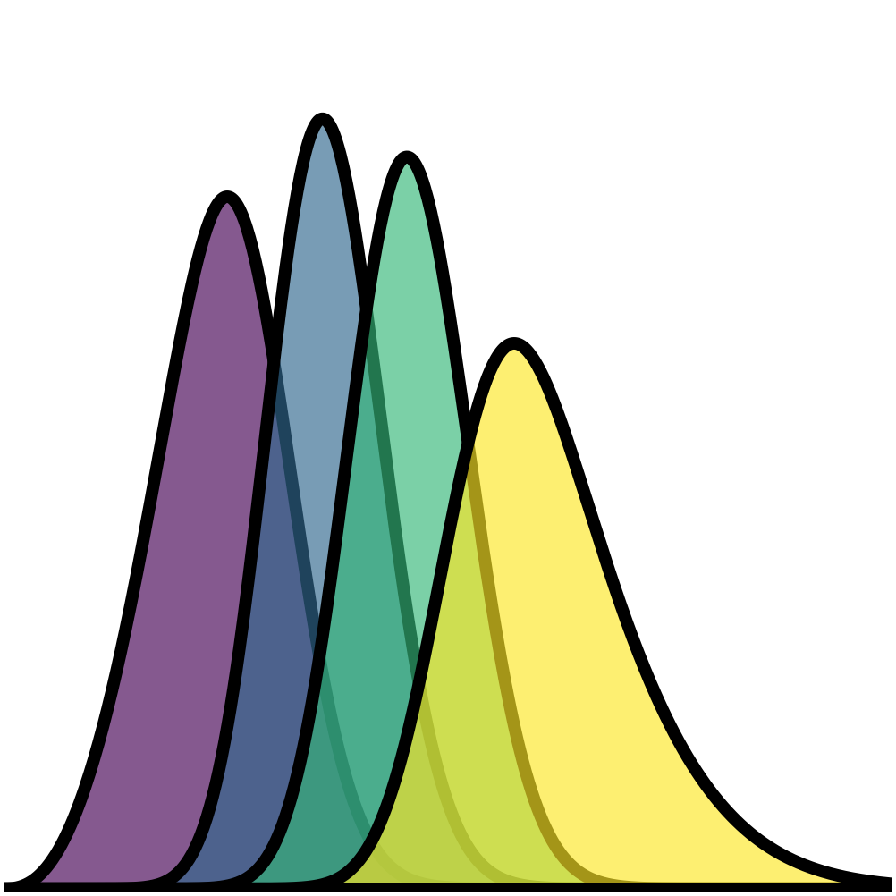

|logo| PSF-dependent source selection
=====================================

Binny also implements a workflow for studying how image quality changes
the source populations used in weak lensing analyses.

In realistic surveys, galaxy detection is not the only selection effect.
Even after a galaxy is detected, it may not be sufficiently resolved
relative to the point-spread function (PSF) to provide a reliable shape
measurement.

This means that changes in the PSF can modify both the effective source
density and the redshift distribution of galaxies available for
cosmological analyses.

The calibration tools implemented in Binny perform three related tasks:

1. estimate PSF-dependent source selection weights,
2. calibrate how the effective source density changes with PSF size,
3. construct source redshift distributions after depth and PSF selection.

This is exposed through
:meth:`binny.NZTomography.calibrate_psf_depth_from_mock`.

The idea is straightforward. Given a mock catalog containing true
redshifts, apparent magnitudes, and galaxy sizes, one considers a
sequence of survey depths and PSF values. For each combination, galaxies
are first selected by magnitude and then weighted according to how well
they are resolved relative to the PSF.

The output is therefore not only a set of redshift distributions, but
also a calibration describing how the usable source population changes
as image quality varies.

Selection model
^^^^^^^^^^^^^^^

The calibration combines two forms of source selection.

First, galaxies are selected according to a limiting magnitude,

.. math::

   m \leq m_{\rm lim},

where :math:`m` is the apparent magnitude of a galaxy and
:math:`m_{\rm lim}` is the limiting magnitude of the survey.

Second, the contribution of each selected galaxy is weighted according
to how well it is resolved relative to the PSF.

Binny describes this through a resolution factor,

.. math::

   R =
   \frac{r_{\rm gal}^2}
        {r_{\rm gal}^2 + r_{\rm PSF}^2},

where :math:`r_{\rm gal}` is a characteristic galaxy size and
:math:`r_{\rm PSF}` is the characteristic PSF size in the same units.

Galaxies with large values of :math:`R` are well resolved, while
galaxies with small values of :math:`R` are poorly resolved.

The resolution factor is converted into a source-selection weight
:math:`w(R)`, either through a hard threshold or through a smooth
transition around a minimum resolution threshold.

These weights are then used when estimating source redshift
distributions and effective source densities from the mock catalog.

As the PSF increases, the resolution factor generally decreases,
reducing the contribution of small galaxies to the source population.
Because small galaxies are often preferentially found at higher
redshift, this process can modify both the effective source density and
the shape of the resulting redshift distribution.

In this way, the calibration approximates the loss of poorly resolved
galaxies as image quality changes, allowing PSF-dependent source
populations to be propagated into forecasting calculations.

Why PSF calibration matters
^^^^^^^^^^^^^^^^^^^^^^^^^^^

Weak lensing forecasts depend on the galaxies that can be used for shape
measurements rather than simply the galaxies that can be detected.

As the PSF becomes larger, small galaxies become increasingly difficult
to resolve. In practice, this usually changes the source sample in two
ways:

- the effective source density decreases,
- the redshift distribution can shift as poorly resolved galaxies are
  removed.

Because high-redshift galaxies often have smaller apparent sizes, PSF
selection can alter the shape of the parent :math:`n(z)` as well as the
overall source density.

In the Binny calibration workflow, these effects are summarized by
constructing PSF-dependent source populations directly from mock
catalogs.

This provides a compact description of how image quality propagates into
forecasting inputs without requiring the full mock catalog to be carried
through every later calculation.

What the calibration does not do
^^^^^^^^^^^^^^^^^^^^^^^^^^^^^^^^

The calibration tools are designed to provide a phenomenological summary
of how source populations change with image quality. They are not
intended to reproduce every aspect of a shear measurement pipeline.

In particular, the calibration should not be interpreted as a complete
model of shape measurement, PSF correction, or shear estimation.

Rather, it provides a compact approximation to the dominant selection
effects that arise because poorly resolved galaxies contribute less
effectively to weak lensing analyses.

Similarly, the resulting source density and redshift distribution
relations are empirical summaries of the mock catalog. They are useful
for forecasting and survey studies, but they do not replace the full
information content of image simulations or end-to-end analyses.

This distinction is important for the theory documentation: Binny
implements a practical interface for modelling changes in source
populations, not a complete weak lensing
measurement framework.

Connection to tomography
------------------------

Once a source population has been calibrated, Binny uses the resulting
redshift distributions as inputs for tomographic analyses.

The PSF calibration itself does not define tomographic bins. Instead, it
determines the parent population available for subsequent tomographic
selection.

It is therefore useful to keep the conceptual separation clear:

- the PSF calibration determines which galaxies remain usable as
  sources,
- the tomography step determines how those galaxies are partitioned into
  bins.

Changes in image quality can therefore affect tomography indirectly by
modifying the parent source population from which the tomographic bins
are constructed.

Summary
-------

Binny implements calibration tools for PSF-dependent source selection
because image quality can alter both the effective source density and
the redshift distribution used in weak lensing forecasts.

Using mock catalogs containing galaxy redshifts, magnitudes, and sizes,
the calibration constructs source populations across a range of survey
depths and PSF conditions.

This allows image quality effects to be propagated into tomographic
forecasting calculations without requiring the full mock catalog to be
reprocessed for every scenario.

For executable usage examples, see the example pages on PSF-dependent
source selection and calibration from mocks.
