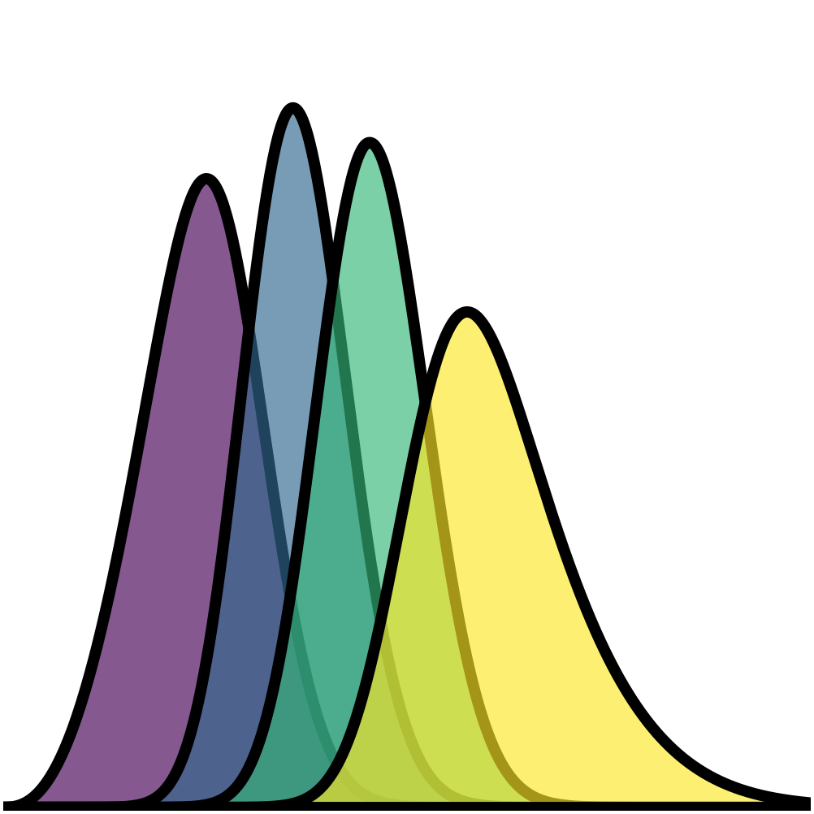
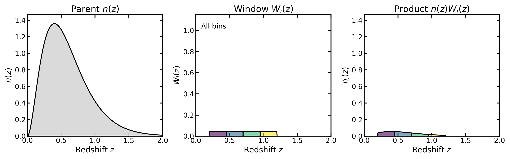
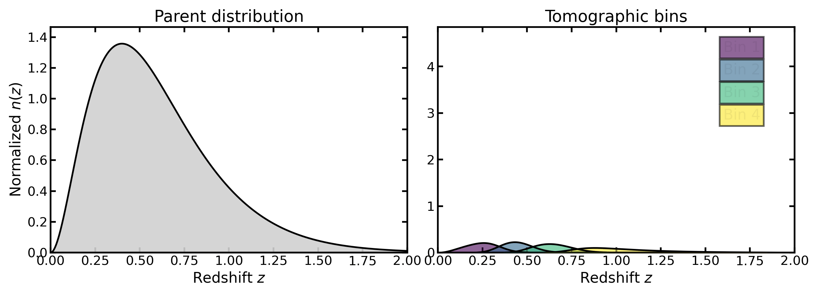
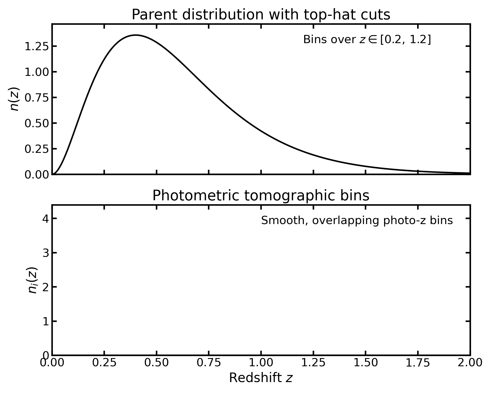
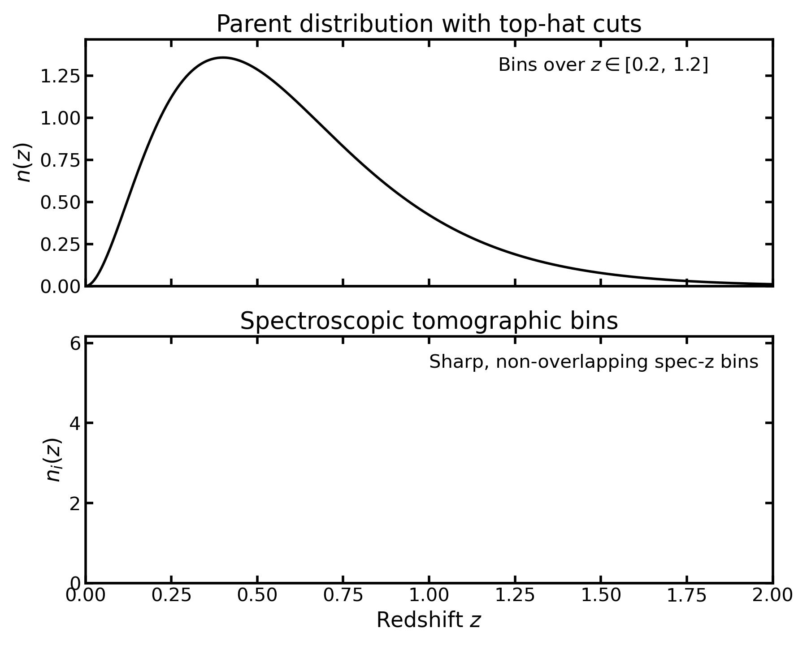
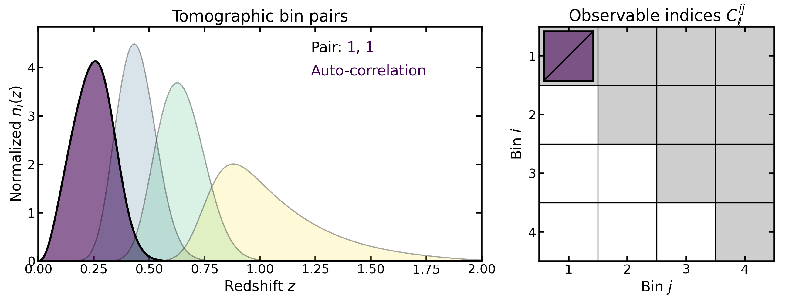
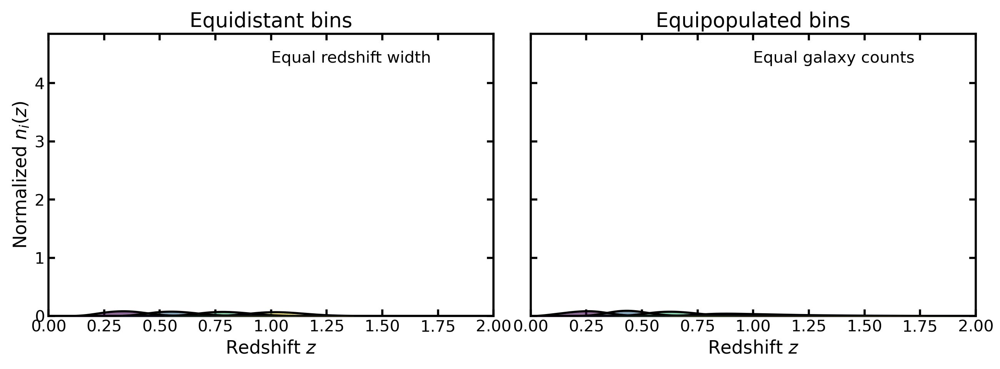
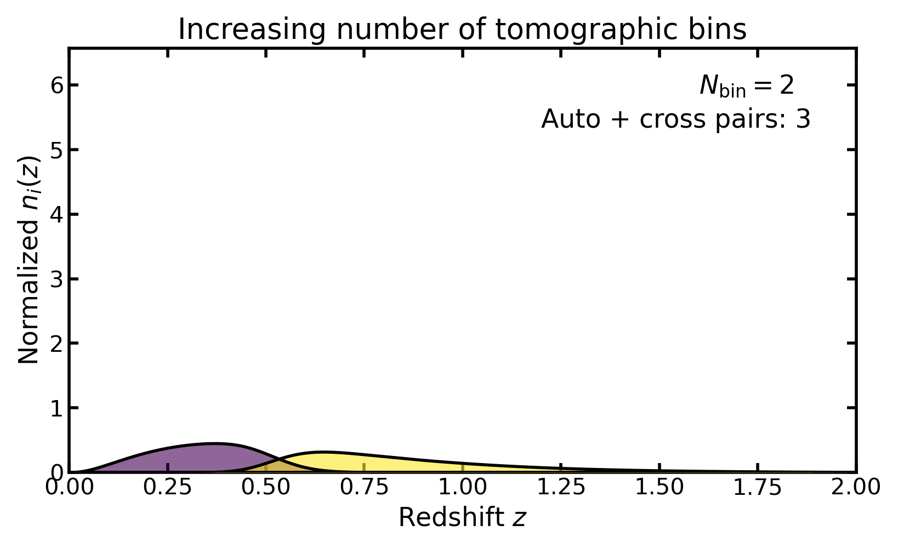

|logo| Tomography
=================

Tomography in cosmological analyses refers to the practice of subdividing a
galaxy sample into redshift bins and measuring correlations both within and
between these bins. By retaining partial redshift information, tomographic
analyses recover information that would otherwise be lost in fully projected
(two-dimensional) measurements.

Binny provides utilities for constructing such tomographic binning schemes
and inspecting their statistical properties.

Tomographic construction
------------------------

At the core of tomography is the redshift distribution of galaxies,
:math:`n(z)`, which describes the number density of objects (galaxies) as a
function of redshift :math:`z`. A tomographic binning scheme partitions this
distribution into a set of bins indexed by
:math:`i = 1, \ldots, N_{\mathrm{bin}}`.

Each bin is defined through a window function :math:`W_i(z)`, such that the
binned distribution becomes

.. math::

   n_i(z) = n(z)\, W_i(z).

Here

- :math:`z` denotes the redshift,
- :math:`n(z)` is the **parent redshift distribution**, describing the number
  density of galaxies as a function of redshift before binning,
- :math:`W_i(z)` is the **window function** for bin :math:`i`, specifying how
  galaxies at redshift :math:`z` contribute to that bin,
- :math:`n_i(z)` is the resulting **binned redshift distribution** for bin
  :math:`i`,
- :math:`N_{\mathrm{bin}}` is the total number of tomographic bins in the
  analysis.

The window functions determine which galaxies contribute to each bin and how
their contributions are weighted.

In the simplest case, the window function corresponds to a hard redshift cut,

.. math::

   W_i(z) =
   \begin{cases}
     1 & z_i^{\mathrm{min}} \le z < z_i^{\mathrm{max}}, \\
     0 & \text{otherwise}.
   \end{cases}

where :math:`z_i^{\mathrm{min}}` and :math:`z_i^{\mathrm{max}}` denote the lower
and upper redshift boundaries of bin :math:`i`.

More general window functions are often used in practice, for example when bins
overlap or when galaxies contribute probabilistically to multiple bins.

This illustrates the tomographic construction directly: a window
:math:`W_i(z)` selects part of the parent distribution :math:`n(z)`,
yielding the binned distribution :math:`n_i(z) = n(z)\,W_i(z)`.

Applying this construction for a set of windows
:math:`\{W_i(z)\}_{i=1}^{N_{\mathrm{bin}}}` produces the full collection of
tomographic bin curves :math:`n_i(z)`.

A parent redshift distribution can therefore be partitioned into a set of
tomographic bin curves :math:`n_i(z)`, each defined on the same redshift grid.

Normalization and bin overlap
^^^^^^^^^^^^^^^^^^^^^^^^^^^^^

In many analyses, each tomographic bin curve :math:`n_i(z)` is normalized
independently so that

.. math::

   \int n_i(z)\,\mathrm{d}z = 1.

The bin curves therefore represent **conditional redshift distributions**
rather than fractions of the parent population. As a consequence, the
amplitude of a normalized bin curve may exceed that of the parent
distribution :math:`n(z)`, since each bin is normalized independently.

In realistic photometric surveys the bin curves typically overlap in true
redshift because galaxies are assigned to bins using photometric redshift
estimates rather than precise spectroscopic measurements.

Spectroscopic vs photometric tomography
---------------------------------------

Tomographic analyses are used in both spectroscopic and photometric surveys,
though the practical implementation differs.

Photometric tomography
^^^^^^^^^^^^^^^^^^^^^^

In photometric surveys, redshifts are estimated from galaxy colors rather than
spectral lines. The resulting bins are typically broader in true redshift and
may overlap even when the nominal bin edges are well separated.

Spectroscopic tomography
^^^^^^^^^^^^^^^^^^^^^^^^

In spectroscopic surveys, redshifts are measured with high precision.
Tomographic bins can therefore be defined with minimal overlap in true redshift,
and the corresponding window functions are often treated as sharply bounded.

Why tomography is useful
------------------------

Tomographic binning allows cosmological correlations to be studied as a function
of redshift, thereby probing the time evolution of large-scale structure. This
is particularly important for observables that integrate information along the
line of sight, such as galaxy clustering or weak gravitational lensing.

By splitting the galaxy sample into multiple bins, one gains access to

- **auto-correlations**, measured between galaxies within the same redshift bin;
- **cross-correlations**, measured between galaxies in different redshift bins.

Tomography produces both auto-bin and cross-bin observables, corresponding to
different pairs :math:`(i,j)` in the tomographic data vector.

The joint analysis of auto- and cross-correlations enables sensitivity to
redshift-dependent physical effects such as the growth of structure, geometric
distances, and galaxy bias evolution. These effects are partially degenerate in
fully projected measurements but become separable when redshift information is
retained.

Tomographic weak-lensing analyses were formalized by Hu (1999) [Hu1999]_,
who showed that even coarse redshift binning can recover a large
fraction of the available three-dimensional information.

Tomographic observables in different probes
-------------------------------------------

In practice, correlations often involve **two distinct galaxy samples**
rather than a single one. A common example is **galaxy–galaxy lensing**,
where galaxies are divided into a **lens sample** and a **source sample**,
each with its own set of tomographic bins.

In this case, the primary observable is the **cross-correlation between
lens and source bins**, which probes how foreground lens galaxies distort
the shapes of background source galaxies through gravitational lensing.
Depending on the analysis strategy, additional correlations may also be
included, such as the **auto-correlations of the lens sample** (galaxy
clustering) or the **auto-correlations of the source sample** (cosmic
shear).

Different cosmological probes therefore make use of **different subsets
of the possible bin–pair correlations**.

For example:

- **Cosmic shear** uses correlations between source bins only. Because
  shear–shear correlations are symmetric, the pair :math:`(i, j)` is
  equivalent to :math:`(j, i)`, so only one of the two needs to be
  computed.

- **Galaxy clustering** uses correlations between **lens bins**, and
  these correlations are also symmetric in :math:`(i, j)`.

- **Galaxy–galaxy lensing** uses **cross-correlations between lens and
  source bins**. In this case the ordering matters: the pair
  :math:`(\mathrm{lens}\,i, \mathrm{source}\,j)` corresponds to the
  lensing signal, whereas :math:`(\mathrm{source}\,j, \mathrm{lens}\,i)`
  does not represent the same observable.

In combined analyses such as **3×2pt** (*the joint analysis of cosmic
shear, galaxy–galaxy lensing, and galaxy clustering two-point
correlations*), several probes are used simultaneously. The resulting
data vector may therefore contain a mix of auto- and cross-correlations
between the tomographic bins of different samples.

Binning schemes
---------------

A tomographic analysis requires a rule for defining the bin boundaries
:math:`\{z_i^{\mathrm{min}}, z_i^{\mathrm{max}}\}`. Several binning strategies
are commonly used.

Equidistant binning
^^^^^^^^^^^^^^^^^^^

In equidistant binning, the redshift interval is divided into bins of equal
width,

.. math::

   z_i^{\mathrm{min}} = z_{\mathrm{min}} + (i-1)\Delta z,
   \qquad
   z_i^{\mathrm{max}} = z_{\mathrm{min}} + i\,\Delta z,

where :math:`\Delta z = (z_{\mathrm{max}} - z_{\mathrm{min}})/N_{\mathrm{bin}}`.

This scheme provides uniform redshift coverage and is frequently used when the
analysis requires a simple geometric partition of the redshift range.

Equipopulated binning
^^^^^^^^^^^^^^^^^^^^^

In equipopulated binning, the bin edges are chosen such that each bin contains
approximately the same fraction of galaxies,

.. math::

   \int_{z_i^{\mathrm{min}}}^{z_i^{\mathrm{max}}} n(z)\,\mathrm{d}z
   \approx
   \frac{1}{N_{\mathrm{bin}}}
   \int n(z)\,\mathrm{d}z.

This approach produces bins with comparable statistical weight and is commonly
used in photometric weak-lensing analyses.

Segmented or mixed binning
^^^^^^^^^^^^^^^^^^^^^^^^^^

More flexible schemes can be constructed by combining different binning
strategies across redshift segments. For example, one may apply equal-number
binning at low redshift while switching to equidistant bins at higher redshift.

Such hybrid approaches allow the binning scheme to adapt to features in the
underlying redshift distribution while preserving control over bin boundaries.

Equidistant binning divides the redshift range into equal-width intervals,
whereas equipopulated binning places edges so that each bin contains a similar
fraction of the parent galaxy sample.

Role of binning in cosmological analyses
----------------------------------------

The tomographic bins define the set of observables used in a cosmological
analysis. For example, a tomographic clustering measurement produces angular
power spectra

.. math::

   C_\ell^{ij}

for all combinations of bins :math:`i` and :math:`j`.

Similarly, weak-lensing tomography produces shear correlations between source
bins, while joint analyses may combine clustering, galaxy–galaxy lensing, and
cosmic shear measurements across multiple bin pairs.

The number of bins and the choice of binning scheme therefore determine both
the dimensionality of the data vector and the redshift resolution of the
resulting cosmological constraints.

Increasing :math:`N_{\mathrm{bin}}` improves redshift resolution but also
increases the number of tomographic observables that enter the analysis.

Binning in Binny
----------------

Binny provides tools for constructing tomographic bins directly from a parent
redshift distribution :math:`n(z)`. Several binning schemes are supported,
including

- **equidistant bins** (uniform redshift spacing),
- **equipopulated bins** (approximately equal galaxy counts per bin),
- **mixed segmented schemes** that combine multiple strategies.

The resulting bins are represented as curves :math:`n_i(z)` on a shared redshift
grid, allowing them to be analyzed, visualized, and compared consistently across
different binning configurations.

Practical usage examples are provided throughout the documentation:

- Examples of **parent redshift models** and analytic :math:`n(z)` functions are
  shown in :doc:`../examples/nz_modelling`.
- Methods for **calibrating redshift distributions from simulations or mock
  catalogs** are demonstrated in :doc:`../examples/nz_calibration`.
- Detailed examples of **photometric tomography**, including overlapping bins
  constructed from photometric redshift estimates, are provided in
  :doc:`../examples/photoz_bins`.
- Examples of **spectroscopic binning**, where bins correspond to sharply
  defined redshift intervals, are shown in :doc:`../examples/specz_bins`.
- Additional diagnostics for inspecting bin shapes, overlaps, and statistical
  properties are illustrated in :doc:`../examples/bin_diagnostics` and
  :doc:`../examples/bin_summaries`.
- Survey-specific binning configurations used in forecasting studies can
  also be constructed using the utilities described in :doc:`../examples/survey_presets`.

References
----------

.. [Hu1999] Hu, W. (1999),
   *Power Spectrum Tomography with Weak Lensing*,
   ApJL 522, L21–L24.
   https://arxiv.org/abs/astro-ph/9904153
