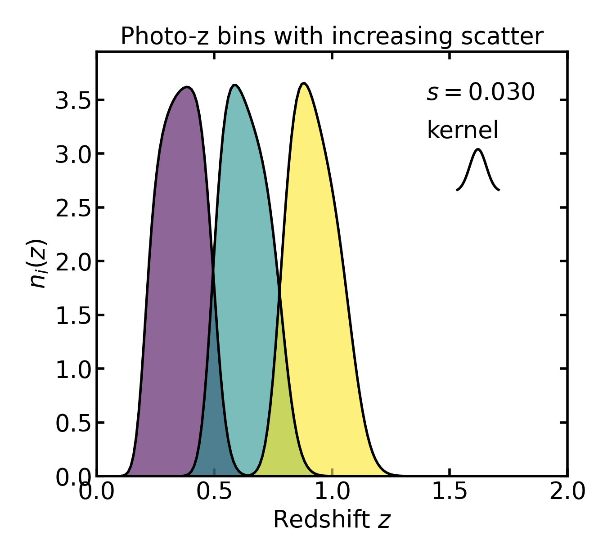
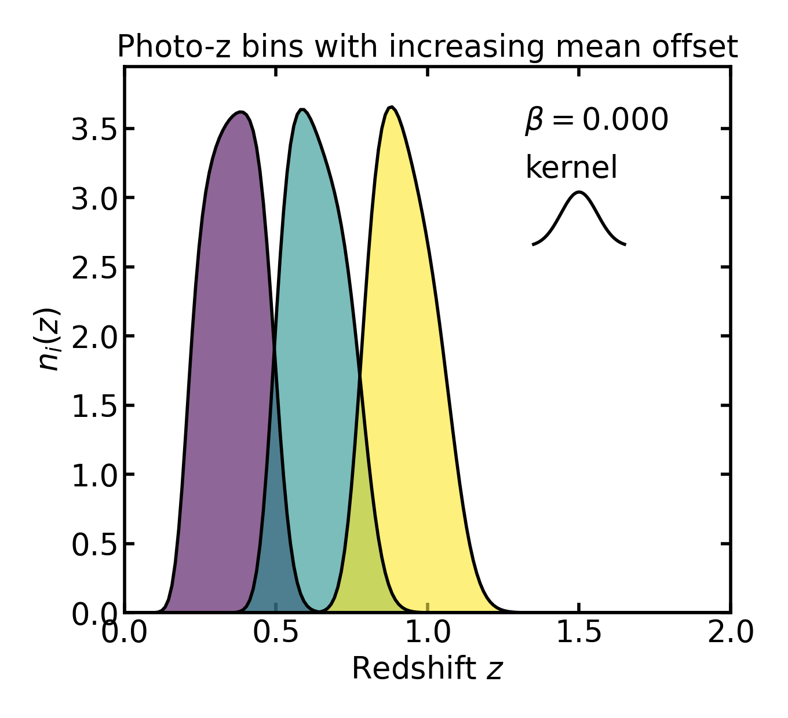
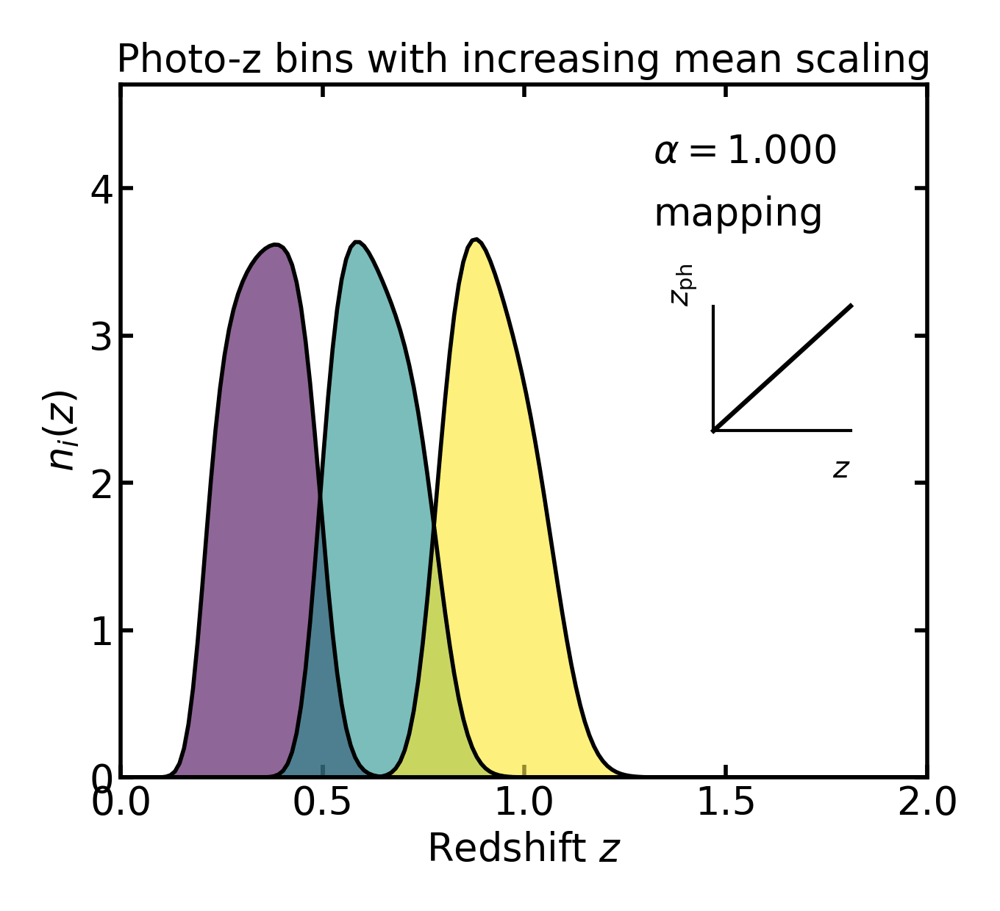
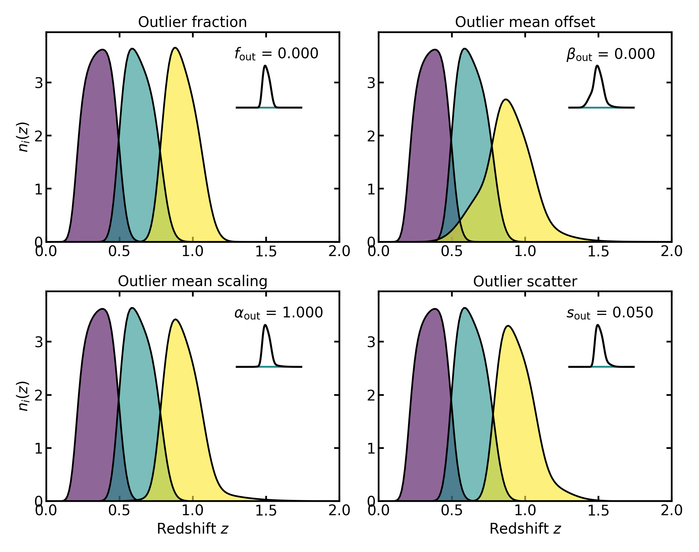

.. |logo| image:: ../../_static/assets/logo.png
   :alt: logo
   :width: 32px

|logo| Photometric-redshift uncertainties
=========================================

In photometric-redshift tomography, tomographic bins are defined in observed
redshift :math:`z_{\mathrm{ph}}`, but the returned bin curves are evaluated on
the true redshift grid :math:`z`.

For an observed-redshift bin with edges
:math:`[z_{\mathrm{ph,min},i}, z_{\mathrm{ph,max},i}]`, the selected
true-redshift distribution is

.. math::

   n_i(z) = n(z)\, P(i \mid z),

where

- :math:`n_i(z)` is the returned tomographic bin on the **true redshift** grid,
- :math:`n(z)` is the parent redshift distribution,
- :math:`P(i \mid z)` is the probability that an object at true redshift
  :math:`z` is assigned to observed bin :math:`i`,
- :math:`z_{\mathrm{ph,min},i}` and :math:`z_{\mathrm{ph,max},i}` are the lower
  and upper observed-redshift edges of bin :math:`i`.

The assignment probabilities satisfy

.. math::

   \sum_i P(i \mid z) = 1,

which ensures that every galaxy at true redshift :math:`z`
is assigned to the set of observed bins with total probability unity.

This means that photo-z tomography does **not** apply a hard cut in true
redshift. Instead, each true redshift value contributes to a bin according to
the photo-z assignment model.

Core Gaussian assignment
------------------------

The core photo-z model assumes that the observed redshift
:math:`z_{\mathrm{ph}}` at fixed true redshift :math:`z` follows a Gaussian
distribution:

.. math::

   z_{\mathrm{ph}} \sim \mathcal{N}\!\bigl(\mu(z), \sigma(z)\bigr),

where

- :math:`z_{\mathrm{ph}}` is the **observed** or photometric redshift,
- :math:`z` is the **true** redshift,
- :math:`\mu(z)` is the mean observed-redshift relation at fixed true redshift,
- :math:`\sigma(z)` is the scatter of the observed-redshift relation,
- :math:`\mathcal{N}(\mu,\sigma)` denotes a Gaussian distribution with mean
  :math:`\mu` and standard deviation :math:`\sigma`.

In Binny, the mean relation is defined as a simple linear function of true
redshift:

.. math::

   \mu(z) = \alpha z - \beta,

where

- :math:`\alpha` is the multiplicative mean-scaling parameter,
- :math:`\beta` is the additive mean-offset parameter.

In the API, these correspond to:

- :math:`\alpha`  : ``mean_scale``
- :math:`\beta`   : ``mean_offset``

The scatter model is

.. math::

   \sigma(z) = s\,(1+z),

where

- :math:`\sigma(z)` is the Gaussian standard deviation in observed redshift,
- :math:`s` is the scatter amplitude.

In the API:

- :math:`s` : ``scatter_scale``

The corresponding conditional density is

.. math::

   p(z_{\mathrm{ph}} \mid z)
   =
   \frac{1}{\sqrt{2\pi}\,\sigma(z)}
   \exp\!\left[
      -\frac{\bigl(z_{\mathrm{ph}}-\mu(z)\bigr)^2}{2\sigma^2(z)}
   \right],

where

- :math:`p(z_{\mathrm{ph}} \mid z)` is the conditional probability density of
  observed redshift at fixed true redshift.

The bin-assignment probability is obtained by integrating this density between
the observed-redshift edges of bin :math:`i`:

.. math::

   P(i \mid z)
   =
   \int_{z_{\mathrm{ph,min},i}}^{z_{\mathrm{ph,max},i}}
   p(z_{\mathrm{ph}} \mid z)\, \mathrm{d}z_{\mathrm{ph}},

where

- :math:`P(i \mid z)` is the probability of assigning a galaxy at true redshift
  :math:`z` to observed bin :math:`i`,
- :math:`\mathrm{d}z_{\mathrm{ph}}` is the integration measure in observed
  redshift.

Because the model is Gaussian, this integral can be written analytically as

.. math::

   P(i \mid z)
   =
   \frac{1}{2}
   \left[
      \operatorname{erf}\!\left(
         \frac{z_{\mathrm{ph,max},i}-\mu(z)}{\sqrt{2}\,\sigma(z)}
      \right)
      -
      \operatorname{erf}\!\left(
         \frac{z_{\mathrm{ph,min},i}-\mu(z)}{\sqrt{2}\,\sigma(z)}
      \right)
   \right],

where

- :math:`\operatorname{erf}` is the error function.

In the implementation, this analytic form is used directly, making the
assignment smooth, fast, and numerically stable.

No-uncertainty limit
--------------------

If the scatter amplitude vanishes, :math:`s = 0`, the Gaussian model reduces
to a deterministic mapping. In that limit,

.. math::

   z_{\mathrm{ph}} = \mu(z) = \alpha z - \beta,

where

- :math:`z_{\mathrm{ph}}` is now a deterministic function of true redshift,
- :math:`\alpha` and :math:`\beta` retain the meanings defined above.

The assignment probability becomes

.. math::

   P(i \mid z) =
   \begin{cases}
   1, & z_{\mathrm{ph}} \in [z_{\mathrm{ph,min},i}, z_{\mathrm{ph,max},i}) \\
   0, & \text{otherwise.}
   \end{cases}

Here

- :math:`1` indicates certain assignment to bin :math:`i`,
- :math:`0` indicates that the object is not assigned to bin :math:`i`.

This is the sharp-selection limit of the photo-z construction.

Photo-z uncertainty terms
-------------------------

The implemented photo-z model includes several distinct uncertainty terms.

Scatter
~~~~~~~

The scatter model is

.. math::

   \sigma(z) = s\,(1+z),

where

- :math:`\sigma(z)` is the Gaussian width in observed redshift,
- :math:`s` is the scatter amplitude.

API mapping:

- :math:`s` : ``scatter_scale``

Larger :math:`s` values broaden the assignment probability
:math:`P(i \mid z)`, increase overlap between neighboring tomographic bins,
and produce less sharply localized true redshift distributions.

Bias / mean shift
~~~~~~~~~~~~~~~~~

The mean relation includes an additive offset,

.. math::

   \mu(z) = \alpha z - \beta,

where

- :math:`\beta` is the additive shift in the mean photo-z relation.

Changing :math:`\beta` shifts the mapping between true redshift and observed
redshift and therefore shifts the location of the tomographic selection.

API mapping:

- :math:`\beta` : ``mean_offset``

Mean scaling
~~~~~~~~~~~~

The same mean relation also includes a multiplicative scaling,

.. math::

   \mu(z) = \alpha z - \beta,

where

- :math:`\alpha` is the multiplicative scaling of true redshift in the mean
  relation.

When :math:`\alpha \neq 1`, the mapping between true and observed redshift is
stretched or compressed with redshift.

API mapping:

- :math:`\alpha` : ``mean_scale``

Outlier mixture
~~~~~~~~~~~~~~~

Binny also supports a second Gaussian component representing catastrophic or
outlier-like photo-z failures. Physically, this is meant to capture a minority
population of objects whose photometric redshift estimates do not follow the
same narrow core relation as the main sample. Instead of having a single
Gaussian assignment model, the conditional density is written as a weighted
mixture of a core component and an outlier component:

.. math::

   p(z_{\mathrm{ph}} \mid z)
   =
   (1-f_{\mathrm{out}})
   p_{\mathrm{core}}(z_{\mathrm{ph}} \mid z)
   +
   f_{\mathrm{out}}
   p_{\mathrm{out}}(z_{\mathrm{ph}} \mid z),

where

- :math:`p_{\mathrm{core}}(z_{\mathrm{ph}} \mid z)` is the core Gaussian
  conditional density,
- :math:`p_{\mathrm{out}}(z_{\mathrm{ph}} \mid z)` is the outlier Gaussian
  conditional density,
- :math:`f_{\mathrm{out}}` is the outlier fraction,
- :math:`1-f_{\mathrm{out}}` is the fraction assigned to the core component.

API mapping:

- :math:`f_{\mathrm{out}}` : ``outlier_frac``

:math:`f_{\mathrm{out}}` controls what fraction of galaxies follow the outlier
redshift model instead of the core relation.
If :math:`f_{\mathrm{out}}=0`, the model reduces to the usual single-Gaussian
photo-z relation. As :math:`f_{\mathrm{out}}` increases, a larger fraction of
objects is assigned according to the outlier component, which can create
extended tails or even a visibly separate secondary contribution in the
returned tomographic bin.

Equivalently, the assignment probability becomes

.. math::

   P(i \mid z)
   =
   (1-f_{\mathrm{out}})\, P_{\mathrm{core}}(i \mid z)
   +
   f_{\mathrm{out}}\, P_{\mathrm{out}}(i \mid z),

where

- :math:`P_{\mathrm{core}}(i \mid z)` is the core assignment probability,
- :math:`P_{\mathrm{out}}(i \mid z)` is the outlier assignment probability.

The outlier component has its own mean and scatter model:

.. math::

   \mu_{\mathrm{out}}(z) = \alpha_{\mathrm{out}} z - \beta_{\mathrm{out}},

.. math::

   \sigma_{\mathrm{out}}(z) = s_{\mathrm{out}} (1+z),

where

- :math:`\mu_{\mathrm{out}}(z)` is the outlier mean relation,
- :math:`\sigma_{\mathrm{out}}(z)` is the outlier scatter,
- :math:`\alpha_{\mathrm{out}}` is the outlier mean scaling,
- :math:`\beta_{\mathrm{out}}` is the outlier mean offset,
- :math:`s_{\mathrm{out}}` is the outlier scatter amplitude.

These parameters control *how* the outlier population differs from the core
one.

Changing :math:`\beta_{\mathrm{out}}` mainly shifts the outlier component,
moving the location of the outlier population relative to the core relation.
In practice, this often makes the secondary contribution appear displaced in
redshift rather than centred on the main peak.

Changing :math:`\alpha_{\mathrm{out}}` changes the slope of the outlier mean
relation with redshift. Rather than acting like a simple rigid shift, it
stretches or compresses the mapping between true and observed redshift for the
outlier population. In the returned bins this can move the outlier contribution
and also change how that displacement varies across redshift.

Changing :math:`s_{\mathrm{out}}` changes the width of the outlier component.
Larger values produce a broader, more diffuse outlier population, while smaller
values keep it narrower and more localized.

Together, these parameters allow a minority population to follow a broader,
shifted, or otherwise distorted redshift-assignment model relative to the core
sample. Depending on the parameter values, the outlier contribution may appear
as an extended tail, a broad shoulder, or a more clearly separated secondary
peak in the returned tomographic bin.

API mapping:

- :math:`f_{\mathrm{out}}` : ``outlier_frac`` — fraction of objects assigned to the outlier population
- :math:`\alpha_{\mathrm{out}}` : ``outlier_mean_scale`` — multiplicative scaling of the outlier mean relation
- :math:`\beta_{\mathrm{out}}`  : ``outlier_mean_offset`` — additive shift of the outlier mean relation
- :math:`s_{\mathrm{out}}`      : ``outlier_scatter_scale`` — scatter amplitude of the outlier Gaussian

Implemented photo-z parameters
------------------------------

The following photo-z parameters are implemented in Binny:

- :math:`s` : ``scatter_scale`` — core Gaussian scatter amplitude
- :math:`\beta` : ``mean_offset`` — additive shift in the core mean relation
- :math:`\alpha` : ``mean_scale`` — multiplicative scaling in the core mean relation
- :math:`f_{\mathrm{out}}` : ``outlier_frac`` — outlier-component fraction
- :math:`s_{\mathrm{out}}` : ``outlier_scatter_scale`` — outlier Gaussian scatter amplitude
- :math:`\beta_{\mathrm{out}}` : ``outlier_mean_offset`` — additive shift in the outlier mean relation
- :math:`\alpha_{\mathrm{out}}` : ``outlier_mean_scale`` — multiplicative scaling in the outlier mean relation

Each of these may be provided either as a scalar, applying the same value to
all bins, or as a per-bin sequence.

Interpreting the returned photo-z bins
--------------------------------------

The returned photo-z tomographic bins are distributions on the **true**
redshift grid. They should therefore be interpreted as

.. math::

   n_i(z) = n(z)\, P(i \mid z),

where

- :math:`n_i(z)` is the returned bin distribution,
- :math:`n(z)` is the parent distribution,
- :math:`P(i \mid z)` is the true-to-observed bin-assignment probability.

They are therefore **not** histograms directly in observed-redshift space.

If ``normalize_bins=True``, each bin is normalized to integrate to unity and
becomes a shape-only redshift probability density. In that case, relative bin
populations are no longer encoded in the returned curves and should instead be
read from the metadata.

Metadata and population fractions
---------------------------------

If metadata is requested, Binny records how much of the original parent
distribution falls into each observed bin **before** any per-bin
normalization.

The stored quantities include:

- ``parent_norm``: total area under the parent distribution :math:`n(z)`
- ``bins_norms[i]``: area under the raw bin curve for bin :math:`i` before normalization
- ``frac_per_bin[i]``: fractional population in bin :math:`i`, computed as
  ``bins_norms[i] / parent_norm`` when the parent norm is nonzero

This distinction is important: once individual bins are normalized, they retain
their redshift *shape* but no longer retain their relative *abundance*.